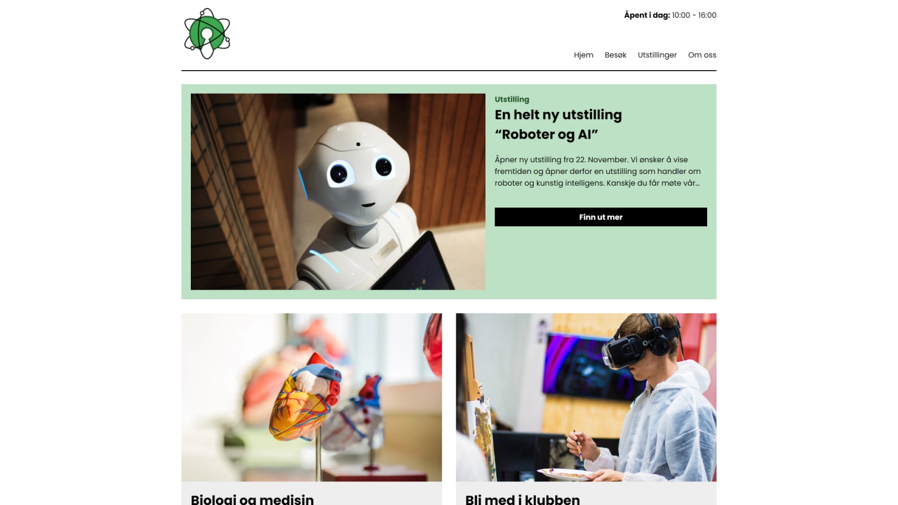

# Semester Project 1



## Description

In this project, you will find a website made for an interactive science museum. The museum wants an informative, appealing website to attract their target audience. The website is informative and engaging, encouraging viewers to visit the museum. The website is responsive and easy to use on various devices.

**Note:** This is a school project and I do not intend to keep it updated. Feel free to use any inspiration from this project if you want.

## Built with

- [HTML](https://developer.mozilla.org/en-US/docs/Web/HTML)
- [CSS](https://developer.mozilla.org/en-US/docs/Web/CSS)

## Getting started

You can find the live website on [Netlify](https://hyseh-semester-project.netlify.app/index.html)

### Installing

Clone the repo:

```bash
git clone git@github.com:hyseh/semester-project-1.git
```

### Running

You can use the Live Server extension to run the project locally.

## Contact

You can contact me at [john.hofland@outlook.com](mailto:john.hofland@outlook.com)
